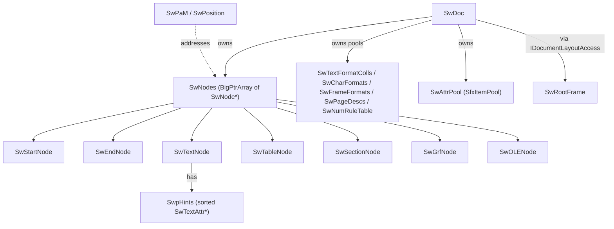
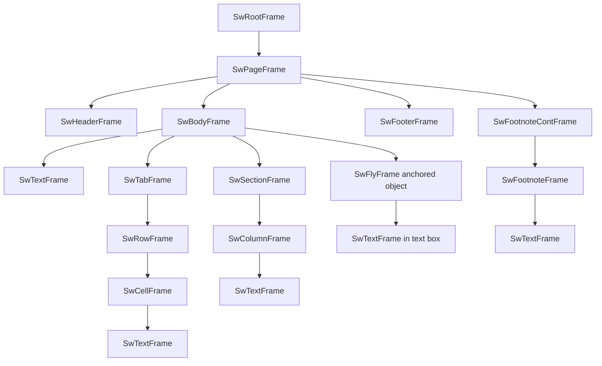
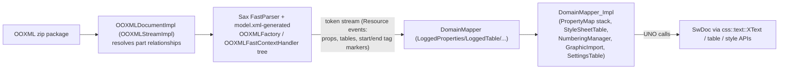

# Writer (sw) Architecture Reference — for a C# Reimplementation

Scope: LibreOffice Writer's document model (`sw/inc`, `sw/source/core`), its layout/rendering
engine (`sw/source/core/layout`, `sw/source/core/text`), and the three main import paths
(DOCX/OOXML via `sw/source/writerfilter`, DOC/WW8 via `sw/source/filter/ww8`, ODF via
`xmloff/source/text` + `sw/source/filter/xml`). Every non-obvious claim below is backed by a
`path:line` citation into this checkout. Paths are relative to the repo root
`/home/user/libreoffice-core`.

NOTE ON THIS CHECKOUT'S LAYOUT: in current `libreoffice-core`, the `writerfilter` module that
older docs refer to as top-level `writerfilter/` has been merged into
`sw/source/writerfilter/{dmapper,ooxml,rtftok,filter,inc}`. All citations below use the real
paths in this tree.

---

## Table of contents

- A. Document model (`SwDoc`, nodes, attributes, styles, fields, marks, redlines, tables)
- B. Layout engine (frame tree, text formatting/portions, painting, units)
- C. DOCX/OOXML import (writerfilter) and DOC/WW8 binary import, RTF
- D. ODF text import/export (xmloff)
- E. Fidelity-ranked feature list with pointers
- F. C# reimplementation plan (data model, phased plan, simplifications)

---

## A. Writer document model

### A.1 Big picture

`SwDoc` (`sw/inc/doc.hxx:206`, a `final` class of ~1840 lines of interface surface) is the
top-level document object. It does not expose all document operations directly — it implements
dozens of small `IDocumentXxx` interfaces (see `sw/inc/IDocument*.hxx`, ~25 files) such as
`IDocumentContentOperations`, `IDocumentFieldsAccess`, `IDocumentMarkAccess`,
`IDocumentRedlineAccess`, `IDocumentLayoutAccess`, `IDocumentStylePoolAccess`,
`IDocumentSettingAccess`, `IDocumentListsAccess`, `IDocumentDrawModelAccess`. This is a deliberate
interface-segregation pattern: any core object that needs "the document" typically stores a
reference to just the interface it needs, not the concrete `SwDoc`. **For a C# port this pattern
is optional** — you can collapse it into one `SwDocument` class with clearly named regions/partial
classes; the ceremony of 25 interfaces exists mainly for LO's internal modularity, not because the
operations are conceptually separable.

### A.2 The node array (`SwNodes`) — the actual "document content"

`sw/inc/node.hxx` and `sw/inc/ndarr.hxx`. Writer's content model is **not a tree** in the DOM
sense — it is a **flat, ordered array of nodes** (`SwNodes : public BigPtrArray`,
`sw/inc/ndarr.hxx`), where nesting (sections, tables, table cells, footnotes, headers, fly frames)
is expressed with **paired start/end marker nodes**, similar to how a flattened XML stream with
push/pop markers would look:

- `SwStartNode` (`sw/inc/node.hxx:352`) — begins a nested "section" of the array; carries a
  `SwStartNodeType` (`SwNormalStartNode`, `SwTableBoxStartNode`, `SwFlyStartNode`,
  `SwFootnoteStartNode`, `SwHeaderStartNode`, `SwFooterStartNode`, ...).
- `SwEndNode` (`sw/inc/node.hxx:382`) — matches a `SwStartNode`; `SwNode::EndOfSectionNode()`
  (`sw/inc/node.hxx:709`) / `StartOfSectionNode()` (`sw/inc/node.hxx:158`) let you jump between the
  pair in O(1) (pointer, not search).
- `SwTableNode : SwStartNode` (`sw/inc/node.hxx:539`) additionally owns a `std::unique_ptr<SwTable>`
  — the actual row/cell/span model (§A.7) lives on this node, while the *cells' content* is
  additional nested start/end-delimited node ranges within the same flat array.
- `SwSectionNode : SwStartNode` (`sw/inc/node.hxx:582`) — "Insert > Section" ranges (also used for
  TOC bodies, index bodies).
- `SwContentNode` (`sw/inc/node.hxx:399`) — abstract base of node types that hold "content":
  `SwTextNode` (a paragraph), `SwGrfNode`/`SwOLENode` (collectively `SwNoTextNode` subclasses,
  representing one image/OLE object each — LO models an embedded picture as its own tiny "node",
  not as an inline run inside a paragraph, except when it's an as-character fly, see §A.6).
- `SwPlaceholderNode` (`sw/inc/node.hxx:636`) — internal-only bookkeeping node used during
  `CopyWithFlyInFly` and undo; not user-visible content, skip in a fresh reimplementation.

`SwNode::GetNodeType()` returns a `SwNodeType` bit flag (`sw/inc/ndtyp.hxx`), and every node knows
its `StartOfSectionIndex()`/`EndOfSectionIndex()`. **Consequence for C#:** you do not need a literal
flat array with start/end sentinels to get correct *semantics* — a conventional tree
(`Document -> Body -> [Paragraph | Table | Section]`, `Table -> Row -> Cell -> Body`) is the more
natural C# representation and is semantically equivalent. But keep the *ordering/traversal*
concept: LO code constantly reasons about "the node before/after X in document order" and "is node
A inside the range [B,C)" — implement an efficient "document order index" (e.g. an integer position
per node maintained like a rope/order-statistics tree) if you need comparisons at scale (e.g. for
redline ranges, bookmarks, TOC generation).

Positions into this array are `SwNodeIndex`/`SwNodeOffset` (an integer index into `SwNodes`) plus,
within a content node, a `SwContentIndex`/character offset. A `SwPosition` (`sw/inc/pam.hxx:37`)
bundles both: `SwNodeIndex nNode; SwContentIndex nContent;`. A `SwPaM` (Point and Mark,
`sw/inc/pam.hxx`) is a pair of `SwPosition` (selection start/end) — the fundamental unit that nearly
every editing/formatting/export API takes as an argument. **This maps directly to a
`(ParagraphOrNodeRef, int charOffset)` pair in C#** — model it as a struct with a stable node
reference + int offset; do not use raw string offsets into a whole-document string, because nodes
routinely get split/merged/inserted and every filter/API works in terms of node+offset.

### A.3 Text attribution: `SwpHints` / `SwTextAttr` — how character formatting is stored

A paragraph's *own* formatting (paragraph style + direct paragraph-level attributes) lives in the
`SwTextNode`'s attribute set (see §A.4). Character-level formatting that applies to only part of
the paragraph's text is stored completely differently: as a **sorted list of interval-tagged
attributes** attached to the node, **not** as per-run objects containing the text.

- `SwTextNode` (`sw/inc/ndtxt.hxx`) holds the paragraph's text as a single `OUString` plus an
  optional `std::unique_ptr<SwpHints> m_pSwpHints` (allocated lazily — a plain, uniformly-formatted
  paragraph has no hints array at all).
- `SwpHints` (`sw/inc/ndhints.hxx:75`) stores `SwTextAttr*` in **three parallel sorted vectors**:
  by start (`m_HintsByStart`), by end (`m_HintsByEnd`), and by `(Which, Start)`
  (`m_HintsByWhichAndStart`) — `sw/inc/ndhints.hxx:84-86`. Sorting is lazy/deferred (a dirty-range
  marker, `m_StartMapNeedsSortingRange` etc., `sw/inc/ndhints.hxx:101-104`) so that many hint
  edits in a row don't each pay O(n log n).
- `SwTextAttr` (`sw/inc/txatbase.hxx:43`) wraps a single `SfxPoolItem` (the actual formatting value,
  e.g. "bold", "font color red", "hyperlink to URL X") together with `m_nStart` and, for
  `SwTextAttrEnd` subclasses (`sw/inc/txatbase.hxx:136`), an `m_nEnd`. So one hint = one
  half-open-or-point interval `[start,end)` (or just `start` for no-end "dummy character"
  attributes like footnotes/fields, see below) tagged with one formatting item.
- Two families of hints, distinguished by `RES_TXTATR_WITHEND_BEGIN..END` vs
  `RES_TXTATR_NOEND_BEGIN..END` ranges in `sw/inc/hintids.hxx:275-301`:
  - **With-end hints** (have both start & end): `RES_TXTATR_CHARFMT` (character style applied to a
    run), `RES_TXTATR_AUTOFMT` (direct/"automatic" character formatting — an inline `SfxItemSet`,
    used for ad-hoc bold/italic/etc. that isn't a named style), `RES_TXTATR_INETFMT` (hyperlink),
    `RES_TXTATR_CJK_RUBY`, `RES_TXTATR_REFMARK`, `RES_TXTATR_TOXMARK`, `RES_TXTATR_META`/
    `METAFIELD` (RDF metadata / content controls' predecessor), `RES_TXTATR_CONTENTCONTROL` (docx
    SDT / structured document tags), `RES_TXTATR_INPUTFIELD`.
  - **No-end hints** (apply to exactly one character position, and that position is filled by a
    reserved "dummy" Unicode char in the text buffer itself — see `CH_TXTATR_*` constants,
    `sw/inc/hintids.hxx:174-191`): `RES_TXTATR_FIELD` (mail-merge/expression/date/etc. field — the
    dummy char is `CH_TXTATR_BREAKWORD = U+0001`), `RES_TXTATR_FLYCNT` (an as-character anchored fly,
    i.e. an inline image/frame — §A.6), `RES_TXTATR_FTN` (a footnote/endnote anchor),
    `RES_TXTATR_ANNOTATION` (a comment anchor), `RES_TXTATR_LINEBREAK` (docx `<w:br>`-style explicit
    line/page/column break embedded in a run, not the paragraph-end).
  - This "dummy character in the string + attribute at that offset" trick is important to replicate
    faithfully: **the length of a paragraph's text (`SwTextNode::Len()`) counts these placeholder
    characters**, and CP/character-offset math throughout the importers (very visible in the WW8
    piece-table code, §C.2) depends on it.
- Ordering rule for same-start-same-end hints matters for rendering priority: comment at
  `sw/inc/hintids.hxx:259-274` — AUTOFMT must sort before CHARFMT (so direct formatting overrides
  the character style), INETFMT before CHARFMT (link style overrides char style on import, but
  CHARFMT is *not* split at INETFMT boundaries — only on ODF export), META/METAFIELD before
  CJK_RUBY/INETFMT (nesting-safety for those attrs that must nest correctly, `SwTextAttrNesting`,
  `sw/inc/txatbase.hxx:152`).
- Precedence chain a renderer must reproduce for any given character position: (1) redline
  formatting if visible (§A.5), (2) `RES_TXTATR_AUTOFMT` hint's item set at that Which, else (3)
  `RES_TXTATR_CHARFMT`/`RES_TXTATR_INETFMT` character style's item, else (4) the paragraph's own
  hard (direct) `SfxItemSet` on the `SwTextNode` (`GetSwAttrSet()`, `sw/inc/node.hxx:748`), else (5)
  the paragraph style (`SwTextFormatColl`) chain via `DerivedFrom()`, else (6) the pool default
  (`GetDfltAttr`, `sw/inc/hintids.hxx:555`). This resolution is implemented by `SwAttrIter`/
  `SwAttrHandler` in `sw/source/core/text/atrstck.cxx` (a "stack" of currently-active attributes
  swept left-to-right across the paragraph — see §B.3).

### A.4 Style model: `SfxPoolItem`/`SfxItemSet`, `SwFormat`, Which-ID ranges

Everything that can be "formatted" in Writer — a character run, a paragraph, a frame, a page, a
table cell, a picture — is represented the same way: an **`SfxItemSet`**, i.e. a sparse map from
integer **Which-ID** to a `SfxPoolItem*` (a small, usually-pooled/refcounted value object: a color,
a font, a border, a page size, ...). `sw/inc/hintids.hxx` is the master registry of Which-ID ranges
for Writer:

| Range | Meaning | Count |
|---|---|---|
| `RES_CHRATR_BEGIN..END` (1..48) | character attrs (font, size, weight, color, underline, CJK/CTL variants, escapement, highlight, ...) | 48 |
| `RES_TXTATR_WITHEND_BEGIN..END` (48..59) | interval hints: refmark, toxmark, meta, metafield, autofmt, inetfmt, charfmt, ruby, unknown-container, inputfield, content control | 11 |
| `RES_TXTATR_NOEND_BEGIN..END` (59..65) | point hints: field, flycnt, footnote, annotation, linebreak, dummy | 6 |
| `RES_PARATR_BEGIN..END` (65..85) | paragraph attrs: line spacing, adjust(alignment), split, orphans/widows, tabstops, hyphenzone, drop-cap, register, numrule, script-space, outline-level, frame-dir, rsid, grabbag | 20 |
| `RES_PARATR_LIST_BEGIN..END` (85..91) | list-specific paragraph attrs: list-id, list-level, is-restart, restart-value, is-counted, list-autoformat | 6 |
| `RES_FRMATR_BEGIN..END` (91..147) | frame/object attrs: size, margins (first-line/text-left/right/gutter), LR/UL space, page-desc, break, header/footer content, print, opaque, protect, surround (wrap), orientation, anchor, background, box(border), shadow, macro, columns, keep, URL, edit-in-readonly, layout-split, chain, text-grid, line-number, footnote/end-at-textend, balanced-columns, frame-direction, row/fly-split, follow-text-flow, wrap-influence, auto-style, style-name, grabbag, vert-adjust, background-full-size, rtl-gutter, decorative, wrap-at-fly-start, page-min-top/bottom | 56 |
| `RES_GRFATR_BEGIN..END` (147..161) | graphic attrs: mirror, crop, rotation, luminance/contrast/gamma/channels/invert/transparency, draw-mode, visible | 14 |
| `RES_BOXATR_BEGIN..END` | table-cell attrs: number format, formula, value | 3 |
| `RES_UNKNOWNATR_*` | passthrough container for unrecognized XML attrs (round-tripping) | 1 |
| `RES_FMT_BEGIN..END` | meta-Which for the format objects themselves (char/frame/fly/txtfmtcoll/grf/draw/cond) | 7 |

(`sw/inc/hintids.hxx:203-452`.) Each Which-ID is declared with `TypedWhichId<T>` so
`GetFormatAttr(RES_CHRATR_COLOR)` is compile-time typed to return `SvxColorItem` — a nice pattern to
copy in C# with generics: `T GetProperty<T>(WhichId id)`.

`SwFormat` (`sw/inc/format.hxx:50`) = name + `SwAttrSet m_aSet` + `DerivedFrom()` pointer to a
parent `SwFormat` (single inheritance chain, walked by `GetItemState(..., bSrchInParent=true, ...)`
until found or pool default). Concrete subclasses:
- `SwTextFormatColl` (`sw/inc/fmtcol.hxx:55`) — **paragraph style** ("Heading 1", "Body Text").
  Has `mpNextTextFormatColl` (the "next style" used when pressing Enter — e.g. Heading→Body Text),
  optional linked character format (`mpLinkedCharFormat`), and outline-level bookkeeping for the
  "assigned to outline numbering" concept (`AssignToListLevelOfOutlineStyle`,
  `sw/inc/fmtcol.hxx:109`).
- `SwCharFormat` (`sw/inc/charfmt.hxx`) — **character style**.
- `SwFrameFormat` (`sw/inc/frmfmt.hxx`) — style backing a **fly frame** (text frame/floating
  object), or a table/row/cell format, or a **page style** parent for header/footer content
  formats. Also used, unnamed and "automatic", as the per-instance property holder for every
  inserted picture/OLE/table/section.
- `SwGrfFormatColl` — paragraph-style-like defaults for graphic nodes (rare).
- `SwConditionTextFormatColl` — a paragraph style with "conditional" sub-formatting rules (e.g.
  "first paragraph in table cell looks different") — see `SwCollCondition`,
  `SwContentNode::ChkCondColl` (`sw/inc/node.hxx:509`).
- Page styles are **not** `SwFormat` subclasses; `SwPageDesc` (`sw/inc/pagedesc.hxx`) is its own
  class holding a "left" `SwFrameFormat` and a "right" `SwFrameFormat` (for mirrored/facing pages)
  plus header/footer `SwFrameFormat`s and next-page-style chaining (`GetFollow()`), used for
  "Different first page" and section-driven page style changes.

Attribute-set ranges (which Which-IDs a given `SwFormat` subclass is allowed to hold) are compact
range lists (`WhichRangesContainer`) like `aTextFormatCollSetRange`, `aCharFormatSetRange`,
`aFrameFormatSetRange`, `aPgFrameFormatSetRange` (`sw/inc/hintids.hxx:580-602`, actual ranges
defined in `sw/source/core/init.cxx`) — i.e., a paragraph style's `SwAttrSet` is sized/typed
specifically to hold CHRATR+PARATR (+ a few FRMATR for things like keep-with-next), while a page
style's holds FRMATR+the page-specific size/margins items.

Style pools live on `SwDoc` as arrays: `SwTextFormatColls`, `SwCharFormats`, `SwFrameFormats`,
`SwPageDescs`, all declared in `sw/inc/docary.hxx` (315 lines) — essentially
`std::vector<SwXxxFormat*>` with name-lookup helpers. `IDocumentStylePoolAccess` provides
`GetPageDescFromPool`/`GetTextCollFromPool` etc. to fetch/create *the* built-in "Heading 1" or
"Default Paragraph Style" object by a `SwPoolFormatId` enum — the mechanism behind "every LO
document always has ~90 built-in styles even if unused."

**C# translation:** you almost certainly do not need a generic `SfxPoolItem`/`SfxItemPool` object
system with refcounting and Which-ID indirection. Model it as a small number of strongly-typed C#
POCOs: `CharacterProperties`, `ParagraphProperties`, `FrameProperties`, `TableCellProperties`, each
a set of `Nullable<T>`/optional fields (bold?, color?, ...), with an explicit "resolve inherited
value" helper that walks (1) direct/hint-level override, (2) character style chain, (3) paragraph's
own paragraph-style chain, (4) document defaults. This is *semantically* identical to LO's
Which-ID/SfxItemSet system but far simpler to write and debug in C#. Keep the **conceptual**
distinction between "hard/direct formatting" (per-instance override) and "style" (named, shared,
inherited) — that distinction is what OOXML `rPr`/`pPr` direct-vs-`w:pStyle`/`w:rStyle` and ODF
automatic-vs-named styles both map onto, and it is required for round-tripping and for correct
"style changed → everything using it re-renders" semantics.

### A.5 Fields, bookmarks/marks, redlines

- **Fields**: `SwField` (abstract, `sw/inc/fldbas.hxx`) + `SwFieldType`. `SwFieldIds` enum
  (`sw/inc/fldbas.hxx:52-98`, ~41 entries) enumerates field kinds: Date/Time, PageNumber, Author,
  Chapter, DocStat, GetExp/SetExp (cross-doc variables), GetRef/SetRef (cross-references),
  HiddenText/HiddenPara (conditional visibility), Postit (comment anchor field), Input, Macro, DDE,
  Table (formula cell), TemplateName, Database fields, Combined Characters, TOX-authority, Dropdown
  form field, ParagraphSignature. A field's live value is inserted into the text as the
  `RES_TXTATR_FIELD` no-end hint (§A.3); on layout/paint, `SwField::ExpandField()` is called to get
  display text (e.g., resolve "page 4 of 12"). **For read-only extraction/rendering, you mostly
  need**: Date/Time, PageNumber/PageCount, Author, cross-reference/bookmark-ref, and simple
  Set/Get expression fields — treat the rest as "expand to their last-known cached text" (LO itself
  caches the last expansion result in the field for cases it can't recompute headlessly).
- **Bookmarks/marks**: `IDocumentMarkAccess` (`sw/inc/IDocumentMarkAccess.hxx:39`), `MarkType` enum
  (`:42-54`): `BOOKMARK`, `UNO_BOOKMARK`, `DDE_BOOKMARK`, `CROSSREF_HEADING_BOOKMARK`,
  `CROSSREF_NUMITEM_BOOKMARK` (auto-generated targets for "insert cross-reference to
  heading/numbered-item"), `ANNOTATIONMARK` (comment range), `TEXT_FIELDMARK`/`CHECKBOX_FIELDMARK`/
  `DROPDOWN_FIELDMARK`/`DATE_FIELDMARK` (legacy DOCX form-field "field char" ranges: `\x13...\x14...\x15`
  start/sep/end markers, imported as marks with a form-field payload), `NAVIGATOR_REMINDER`. Marks
  are `(SwPosition start, SwPosition end-or-same, name)` triples independent of the hints system —
  used for bookmarks, comment ranges, and cross-reference targets.
- **Redlines (tracked changes)**: `SwRedlineTable` (`sw/inc/redline.hxx`) is a sorted array of
  `SwRangeRedline` (a `SwPaM` + author/date/`RedlineType` — Insert/Delete/Format/ParagraphFormat/
  TableRowInsert/TableRowDelete/...). Rendering with "show changes" on requires overlaying redline
  formatting (strike-through for deletions, underline+color for insertions, a change bar in the
  margin) *on top of* the normal attribute resolution chain from §A.3 — this is done by
  `SwRedlineItr`/`SwExtend..` classes in `sw/source/core/text/redlnitr.cxx`, injected as the
  highest-priority layer in `SwAttrIter`. A renderer that must show tracked changes needs this as an
  explicit extra formatting layer, not a special case of character styles.
- **Footnotes/endnotes**: modeled as a `RES_TXTATR_FTN` no-end hint (`SwFormatFootnote`) anchoring
  into a footnote/endnote **section** in the node array (a `SwStartNode`/`SwEndNode` pair of type
  `SwFootnoteStartNode`) that holds the actual footnote body paragraphs. Layout-wise a footnote gets
  its own `SwFootnoteFrame`, collected per page into a `SwFootnoteContFrame` at the bottom of the
  body area (see §B.1); numbering/restart-per-page/-per-section rules come from
  `SwFootnoteInfo`/`SwEndNoteInfo` on `SwDoc`.
- **Sections**: `SwSectionNode`, wraps a `SwSection` (name, protect/hidden flags, optional linked
  file, optional column layout, optional footnote-behavior overrides). Renders as a
  `SwSectionFrame` that is transparent for most layout purposes except columns/protection/
  visibility.

### A.6 Frames/anchoring (floating objects, images, text boxes)

Floating content (pictures, OLE objects, text frames, shapes) is represented by a `SwFrameFormat`
of subtype fly (`SwFlyFrameFormat`) or draw (`SwDrawFrameFormat`) carrying a `RES_ANCHOR`
(`SwFormatAnchor`, `sw/inc/fmtanchr.hxx:33`) attribute. The anchor type is a `RndStdIds`
(`include/svx/swframetypes.hxx:27`), and **these five values are intentionally numerically equal
to `css::text::TextContentAnchorType`** so UNO/ODF/OOXML anchor types map 1:1:

| RndStdIds | Meaning | Anchor storage |
|---|---|---|
| `FLY_AT_PARA` | anchored to a paragraph (floats independent of text flow within/around that paragraph) | `SwPosition` pointing at the paragraph node |
| `FLY_AS_CHAR` | anchored *as a character* inline in the text flow (like an inline image) | `SwPosition` + the anchor paragraph also carries a `RES_TXTATR_FLYCNT` hint at that char offset |
| `FLY_AT_PAGE` | anchored to an absolute page number, independent of any node | no content anchor; just `m_nPageNumber` |
| `FLY_AT_FLY` | anchored inside another fly frame (nested objects, e.g. text box inside text box) | `SwPosition` pointing at the other fly's start node |
| `FLY_AT_CHAR` | anchored to a specific character position, floats around that point but is not a run itself | `SwPosition` with a char offset |

(`include/svx/swframetypes.hxx:32-36`, `sw/inc/fmtanchr.hxx:38-72`.) `FLY_AS_CHAR` is the only kind
that participates directly in line layout (it produces an `SwFlyCntPortion`, see §B.3); the other
four are positioned by the object-position/wrap solver (`sw/source/core/layout/anchoredobject.cxx`,
`objectpositioning/`) and then wrapped around by text using `SwTextFly`/contour data (§B.4). Text
wrap behavior is `RES_SURROUND` (`SwFormatSurround`, none/parallel/through/ideal/left/right) plus
optional bitmap **contour** (non-rectangular wrap) computed from the picture's alpha/poly outline.

### A.7 Tables

`SwTable` (`sw/inc/swtable.hxx`) is the logical table model, independent of layout:
`SwTableLines` (rows) → each `SwTableLine` has `SwTableBoxes` (cells) → each `SwTableBox` either
contains nested `SwTableLines` (a **box can itself contain rows** — this is how "split
cell"/complex nested table layouts inherited from WW8's box-nesting model are represented) or a
`SwStartNode`/`SwEndNode` range holding the cell's paragraph/table content. Row/column span is
**not** classic HTML `colspan`/`rowspan`: column span is expressed implicitly by each box knowing
its width and the table knowing the total logical column count/widths (`SwTableLines`'s boxes'
widths must sum to the row width; a box spanning 2 of 4 logical columns just has a wider single
box), while *row* span is an explicit `mnRowSpan` field on `SwTableBox`
(`sw/inc/swtable.hxx:460,543`) — positive N means "start of a vertical merge spanning N rows",
negative means "this box is a continuation/hidden follower of a merge above it" (this negative-value
convention is how LO internally represents merged-away cells while keeping the node array
rectangular/complete). A `SwTableBoxFormat` (a `SwFrameFormat`) carries the cell's borders/shading/
vertical-alignment; `RES_BOXATR_*` items carry numeric value/formula/format for calculation cells.
Table style/`SwTableFormat` provides table-wide defaults (repeat header row count, table-wide
borders/spacing) — `GetRowsToRepeat()` (`sw/inc/swtable.hxx:200`) is the header-row-repeat-across-
page-breaks feature.

### A.8 Lists / numbering

`SwNumRule` (`sw/inc/numrule.hxx:96`) holds up to 10 `SwNumFormat` levels (`sw/inc/numrule.hxx:50`,
each a `SvxNumberFormat`: numbering type — arabic/roman/alpha/bullet/none/chapter — plus
indent/suffix/prefix/start-at). A paragraph is put "in" a list via the paragraph attribute
`RES_PARATR_NUMRULE` (`SwNumRuleItem`, holds the rule's *name*, resolved through the doc's
`SwNumRuleTable`) plus the `RES_PARATR_LIST_*` family (`RES_PARATR_LIST_ID` — a document-unique
list *instance* id so two paragraphs can share a numbering *definition* but be different running
lists; `RES_PARATR_LIST_LEVEL`; `RES_PARATR_LIST_ISRESTART`/`RESTARTVALUE`; `RES_PARATR_LIST_ISCOUNTED`
— "skip this paragraph in the numbering count" checkbox). Chapter/outline numbering is the special
case where a `SwNumRule` is *assigned to the outline styles* (`AssignToListLevelOfOutlineStyle`,
`sw/inc/fmtcol.hxx:109`) so Heading 1..9 paragraph styles automatically participate in it. Actual
number computation (what number does paragraph N show) is a tree — `SwNumberTree`
(`sw/inc/SwNumberTree/`) — that must be re-walked whenever paragraphs are inserted/deleted/
restarted; a straightforward incremental per-level-counter-array approach is sufficient for a
render-only reimplementation, you do not need LO's undo-aware tree.

### A.9 Page styles, headers/footers

`SwPageDesc` (`sw/inc/pagedesc.hxx`) = name + two `SwFrameFormat`s (`Master`/`Left`, for
odd/even mirrored pages) + optional `Follow` page-desc pointer (page-style chaining, e.g. "First
Page" style automatically follows with "Default Page Style" from page 2 on) + numbering-type
(arabic/roman/...) + header/footer share-content-left-right flags. Header/footer *content* is
itself stored as `RES_HEADER`/`RES_FOOTER` (`SwFormatHeader`/`SwFormatFooter`) items on the page's
`SwFrameFormat`, each wrapping its own tiny `SwFrameFormat` whose `RES_CNTNT` points at a
`SwStartNode`/`SwEndNode` range of paragraphs — i.e. headers/footers are modeled exactly like a fly
frame's content, reusing the same "format + anchored node range" idiom used everywhere else in sw.
A new page style (and therefore new header/footer/margins/columns) is triggered mid-document by the
paragraph attribute `RES_PAGEDESC` (`SwFormatPageDesc`) on the first paragraph of a new "section" in
the Word sense — this is precisely how DOCX section breaks (`w:sectPr`) and ODF page-style changes
via `master-page-name` are represented once imported.

---

## B. Layout engine

### B.1 Frame hierarchy

Layout ("frames", confusingly also LO's word for the visual box tree, distinct from "fly frames"
which are one specific frame subtype) is a **second, parallel tree** built from the node array,
purely for pagination/rendering; the node array itself has no concept of pages/lines/columns.
Base class `SwFrame` (`sw/source/core/inc/frame.hxx`, private/internal — not in the public `sw/inc`
API surface) carries a `SwFrameType` bitmask (`sw/source/core/inc/frame.hxx:75-94`: Root, Page,
Column, Header, Footer, FootnoteContainer, Footnote, Body, Fly, Section, Tab, Row, Cell, Txt,
NoTxt) so type-tests are cheap bit tests, and a `SwFrameAreaDefinition` (`SwRect maFrameArea`
[outer, includes borders/margins] + `SwRect maFramePrintArea` [inner content rect]).

Concrete classes (all `sw/source/core/inc/*.hxx`, non-public):
- `SwRootFrame final : SwLayoutFrame` (`rootfrm.hxx:83`) — one per document/view; owns the ordered
  chain of `SwPageFrame`s.
- `SwPageFrame final : SwFootnoteBossFrame` (`pagefrm.hxx:61`) — one page; a "footnote boss" because
  pages (and columns) are what own/collect footnote containers.
- `SwLayoutFrame : SwFrame` (`layfrm.hxx:37`) — abstract "frame that contains other frames" (body,
  header, footer, section, column, cell, tab, fly all derive from this or `SwFootnoteBossFrame`).
- `SwContentFrame : SwFrame` — abstract "leaf that holds actual content"; two concrete kinds:
  `SwTextFrame final` (`txtfrm.hxx:174`, by far the most important class in the whole layout module
  — one instance per *displayed* paragraph fragment; a paragraph split across a page break gets a
  **master** `SwTextFrame` plus one or more **follow** `SwTextFrame`s chained via `GetFollow()`) and
  `SwNoTextFrame` (`notxtfrm.hxx`, for graphic/OLE nodes).
  `SwTabFrame`, `SwRowFrame`, `SwCellFrame` (table); a table too can split across pages, producing
  master/follow `SwTabFrame`s analogous to text frames.
  `SwSectionFrame`/`SwColumnFrame` (sections and their column sub-frames).
  `SwFlyFrame`/subclasses in `flyfrms.hxx` (anchored objects: at-para/at-char/as-char/at-page all
  ultimately produce an `SwFlyFrame`, which is itself a `SwLayoutFrame` that can contain arbitrary
  content, including nested tables/text/other flys).
  `SwFootnoteFrame`/`SwFootnoteContFrame` (`ftnfrm.hxx`).
  `SwHeaderFrame`/`SwFooterFrame` (`hffrm.hxx`), `SwBodyFrame` (`bodyfrm.hxx`).

Layout is driven by an "action" pass, `SwLayAction` (`sw/source/core/layout/layact.cxx`), which
repeatedly calls `SwFrame::Calc()`/`MakeAll()` on invalid ("touched"/dirty") frames until the tree
is fully valid — an incremental, invalidate-and-recompute model (similar in spirit to a browser
layout/reflow engine), not a single top-down pass. `SwFrame::Grow`/`Shrink` (`frame.hxx:540-542`)
implement flow-driven resizing (a paragraph growing because it wrapped to another line pushes
following content down; a table row growing pushes its page). `MakeFrame(pSib)` virtual on
`SwContentNode` (`sw/inc/node.hxx:433`) is the "create a display frame for this node" factory; new
frames are created lazily as pages fill and are destroyed/reflowed on edits or reformat.

**Pagination trigger for a paragraph:** `SwTextFrame::WouldFit()` (`sw/source/core/text/txtfrm.cxx:3508`)
answers "if I only had `rMaxHeight` twips left on this page, would I fit, and if not, could I split
(and where)?" — used by the flow code when growing the current page's body is not enough room;
splitting itself creates a follow `SwTextFrame` starting at the first character that didn't fit
(computed via the same line-breaking pass described in §B.2/§B.3, not re-derived heuristically), so
a faithful reimplementation must run the *real* per-line formatter to decide break points, not an
approximate average-line-height estimate, if pixel-accurate pagination matters.

### B.2 Twips and the unit system

`SwTwips` = `tools::Long` (`sw/inc/swtypes.hxx:51`) — Writer's entire internal document geometry
(frame rects, margins, font sizes' internal storage after `SvxFontHeightItem` conversion, etc.) is
**twips**, i.e. 1/1440 inch = 1/20 point = 1/1728 cm-ish (px conversion depends on the target DPI).
ODF stores lengths in 1/100 mm ("mm100") and OOXML stores most lengths in twips already (some in
EMU = 1/360000 cm for drawing objects, some in half-points for font sizes) — the filters do the
twip⇄mm100⇄EMU conversions at import/export boundaries (`o3tl::convert`, `editeng`/`svx` helper
functions; see `sw/source/writerfilter/dmapper/ConversionHelper.cxx` for the OOXML side and
`sw/source/filter/xml/xmlitmap.hxx`/`xmlitmpr.cxx` for the ODF side). **For a C# port: pick one
internal unit (recommend: twips, as an `int`, to match LO's rounding behavior bit-for-bit in edge
cases, or EMU if you want finer precision for image placement) and centralize conversion helpers;
do not carry doubles through the layout math** — LO's integer-twips arithmetic is a real source of
its exact line-break/page-break behavior, and using floating point instead will produce
subtly-different wraps on some documents.

### B.3 Text formatting / line breaking: the "portion" model

This is the algorithmic heart of Writer's rendering fidelity. A paragraph's laid-out
representation is a `SwParaPortion : SwLineLayout : SwTextPortion : SwLinePortion`
(`sw/source/core/text/porlay.hxx:289,78`, `portxt.hxx:26`) — i.e. a **linked list of lines**
(`SwLineLayout::m_pNext`, `porlay.hxx:81`), each of which is itself a **linked list of portions**
(`SwLinePortion` is the abstract base — every portion knows only its own `Width()`/`Height()` and a
"next portion" pointer; there is no random-access array of portions, it's iterated).

`PortionType` enum (`sw/source/core/inc/txttypes.hxx:40-108`) enumerates the portion kinds actually
used — this list *is* effectively the feature set of Writer's text renderer:
- **Text-bearing**: `Text` (plain run), `Hanging`, `InputField`, `FieldMark`/`FieldFormCheckbox`
  (DOCX legacy form fields), `Drop` (drop-cap glyph(s)), `Tox`/`IsoTox`/`Ref`/`IsoRef` (index/
  cross-reference generated text), `Meta`, `ContentControl` (SDT).
- **Expanding/generated text**: `Field` (field result text), `Hidden` (hidden-text field
  placeholder), `QuoVadis`/`ErgoSum` (footnote continuation "contd. on next page" text),
  `Combined` (combined characters, CJK), `Footnote` (footnote anchor number in body text),
  `FootnoteNum`/`Number`/`Bullet`/`GrfNum` (list numbering label / bullet / picture bullet).
  `Hyphen`/`HyphenStr`/`SoftHyphen(Str)`/`SoftHyphenComp` — hyphenation break glyph variants.
- **Non-text spacers/fixed**: `Hole` (a gap for a deleted/hidden char that still reserves layout
  width), `Break`, `Kern`, `Arrow` (bidi arrows), `Margin`/`Fix`/`Fly` (reserved space for an
  anchored object intruding into the line), `Tab`/`TabRight`/`TabCenter`/`TabDecimal`/`TabLeft` (tab
  stops, each alignment a distinct portion subtype because each computes its width differently
  relative to the next tab stop), `Multi` (nested multi-line content: ruby text, 2-lines-in-one, or
  rotated text — a portion that itself contains a nested `SwLineLayout`), `FlyCnt` (an as-character
  anchored object), `Bookmark`, `PostIts` (comment anchor marker glyph), `ControlChar`.

Formatting is driven by `SwTextFormatter : SwTextPainter` (`sw/source/core/text/itrform2.hxx:33`),
fed by `SwTextFormatInfo : SwTextPaintInfo : SwTextSizeInfo : SwTextInfo`
(`sw/source/core/text/inftxt.hxx:103,122,357,505` — a 4-level info-object inheritance where each
level adds state needed for a successive phase: raw text info → size-measurement info → paint info
→ full format info with line-breaking state). The line-breaking algorithm is essentially: walk the
paragraph's `SwpHints`-resolved attribute runs (via `SwAttrIter`, itself driven by
`atrstck.cxx`/`atritr.cxx`), build portions greedily filling the available line width (line width
comes from the containing frame's print area, reduced by any intruding fly/margin portions for that
line), defer to `SwTextGuess` (`guess.hxx`) for where a text portion may legally break (word
boundaries, script boundaries, kerning-affected width recompute), invoke hyphenation
(`txthyph.cxx`) at the break candidate if the hyphenation zone requires it, then run
justification/adjustment (`itradj.cxx`: distributes `SwLineLayout::m_pLLSpaceAdd` extra space
across spaces/kana for justified text, tracks `m_aKashida` positions for Arabic justification via
kashida elongation). Widow/orphan control across a page break is `WidowsAndOrphans`
(`sw/source/core/text/widorp.cxx`) consulting `SvxWidowsItem`/`SvxOrphansItem` /
`SvxFormatSplitItem` (keep-paragraph-together) / `SvxFormatKeepItem` (keep-with-next).

Script/complex-text handling: `SwScriptInfo` (`scriptinfo.hxx`) precomputes, per paragraph, the
runs of Latin/Asian(CJK)/Complex(CTL, e.g. Arabic/Hebrew) script so the correct one of the
three parallel character-attribute sets (`RES_CHRATR_FONT`/`RES_CHRATR_CJK_FONT`/
`RES_CHRATR_CTL_FONT`, similarly for size/weight/posture/language, `sw/inc/hintids.hxx:210-234`) is
used per run, and so RTL/bidi reordering and vertical (CJK) writing modes can be applied. **This is
one of the highest-effort, highest-payoff areas to get right if any Asian/Arabic/Hebrew content
must render — treat it as a first-class subsystem, not an afterthought**: font selection literally
depends on detected script, independent of any explicit language attribute.

### B.4 Text wrap around floating objects

`SwTextFly` (`sw/source/core/inc/txtfly.hxx`, impl `txtfly.cxx`) computes, per line, the horizontal
"holes" carved out of the available line width by any anchored object (fly/shape/image) whose
`RES_SURROUND` says it should wrap (parallel/dynamic) rather than sit `THROUGH`/`NONE`. For
non-rectangular wrap ("contour"), the object's outline polygon (`tools::PolyPolygon`, computed from
alpha channel for bitmaps or explicit path for shapes) is intersected against each candidate line's
horizontal band to get the actual left/right obstruction per line — i.e. contour wrap is computed
per-line, not once per object. A simplified reimplementation can start with rectangular
bounding-box wrap (handles the vast majority of real documents) and treat contour wrap as a later
phase.

### B.5 Where painting happens; device abstraction

Entry point for the whole visible tree: `SwRootFrame::PaintSwFrame`
(`sw/source/core/layout/paintfrm.cxx:3225`) recurses through `SwLayoutFrame::PaintSwFrame`
(`paintfrm.cxx:3672`) down to leaf frames; `SwCellFrame`/`SwFlyFrame`/`SwTabFrame` each override
`PaintSwFrame` for borders/background/shadow specifics (`paintfrm.cxx:4225,4264,4663`) before
delegating back to `SwLayoutFrame::PaintSwFrame` for children. For actual text, the leaf is
`SwTextFrame::PaintSwFrame` (`sw/source/core/text/frmpaint.cxx:659`), which constructs a
`SwTextPainter aLine(this, &aInf)` (`frmpaint.cxx:773`) and calls `aLine.DrawTextLine(...)`
(`frmpaint.cxx:791`) — i.e. **painting re-walks the same portion chain built during formatting**,
each portion's `Paint(const SwTextPaintInfo&)` virtual (`sw/source/core/text/porlin.hxx:161`)
drawing itself (glyphs via `OutputDevice::DrawTextArray`-family calls, tab/underline/strike-through
as rects/lines, fields/bullets as their expanded text, `Fly`/`FlyCnt` portions recursing into the
anchored object's own frame paint). Painting is layered: background/shadow/border first (via
`SwFrame::PaintSwFrameShadowAndBorder`, `paintfrm.cxx:5537`, and `SwLineRects`/`SwSubsRects`
helper classes for border-edge de-duplication/dashed lines, `paintfrm.cxx:566,871,989`), then
content, then (if enabled) redline change-bars/margin annotations, then non-printing "subsidiary"
UI aids (table boundaries, text boundaries, section marks — irrelevant for a rendering-only C#
port, skip these).

Device abstraction: everything paints through `vcl::RenderContext`/`OutputDevice` (VCL's device
abstraction — same class hierarchy backs screen rendering, printing, and PDF/metafile export), so
LO's actual glyph drawing calls (`DrawTextArray`, `DrawPolyPolygon`, `DrawRect`, `DrawLine`, ...) are
already device-agnostic. **For a C# reimplementation this is the natural seam**: build your own
`IRenderTarget`/`IDrawingContext` interface (draw glyph run at position with font, draw rect, draw
line, draw polygon, draw image) with implementations for `SkiaSharp`/`System.Drawing`/PDF-writer/
whatever headless target you choose, and have your text-portion-painting code call only that
interface — mirroring exactly how LO isolates format-time portion geometry from paint-time device
calls (the portion objects themselves hold no device reference; only the paint pass does).

---

## C. Import filters

### C.1 DOCX/OOXML (`sw/source/writerfilter/{ooxml,dmapper}`)

Two-stage pipeline:

**Stage 1 — tokenizer/model.** `sw/source/writerfilter/ooxml/model.xml` (19.5k lines!) is a
declarative grammar: for every WordprocessingML element it says which "resource" (property,
paragraph-property, table-property, sprm, ...) it maps to and which child elements/attributes are
legal. Python scripts (`factoryimpl.py`, `factoryimpl_ns.py`, `factoryinc.py`, `qnametostr.py`,
`modelpreprocess.py`) consume `model.xml` at *build time* to generate the C++
`OOXMLFactory_ns.cxx`/token tables — i.e., **the OOXML grammar is data-driven, not hand-coded per
element**, unlike the ODF import below which is hand-coded classes per element.
`OOXMLFastContextHandler` (`sw/source/writerfilter/ooxml/OOXMLFastContextHandler.hxx/.cxx`) is the
SAX-fastparser context that, per model.xml-declared resource type, accumulates an
`OOXMLPropertySet`/`OOXMLValue` and on end-of-element hands a "Resource" event up to the mapper
layer.

**Stage 2 — DomainMapper.** `DomainMapper` (`sw/source/writerfilter/dmapper/DomainMapper.hxx:72`,
`.cxx` 5494 lines) implements the `Properties`/`Table`/`Stream` "Logged*" resource-consumer
interfaces (`LoggedProperties`, `LoggedTable`, ...) — i.e. it is the generic consumer of whatever
Stage 1 emits, translating Word-centric concepts (SPRM-like property IDs, paragraph/character
property bags) into `SwDoc` operations via UNO (`css::text::XText`, `XTextRange`, paragraph/
character property sets) rather than touching `SwDoc` C++ API directly — **DomainMapper builds the
document exclusively through the public UNO service API**, the same API an external Basic macro or
an out-of-process client would use. This is a major architectural fact: **a from-scratch importer
does not need to replicate `SwDoc`'s internal node-array mutation API** — mapping DOCX properties
to a clean intermediate object model (paragraph list + run list + property bags) and then a single
"build my own document model from this" pass is sufficient, matching what dmapper effectively does.
`DomainMapper_Impl` (10514 lines, the "real" state machine) owns:
- `PropertyMap`/`SectionPropertyMap`/`ParagraphPropertiesPropertyMap`/`TablePropertyMap`
  (`PropertyMap.hxx:142,238,569,612`) — a stack of "current property context" objects, pushed/
  popped as the SAX-like stream enters/exits paragraphs, runs, table cells, sections; this mirrors
  OOXML's own `pPr`/`rPr`/`tblPr`/`sectPr` nesting.
- `StyleSheetTable` (`styles.xml` → named styles + style inheritance `w:basedOn` chains +
  `w:next`/`w:link`).
- `NumberingManager` (`numbering.xml` → abstractNum/num instance model, closely mirrors
  `SwNumRule`/list-id split from §A.8).
- `GraphicImport` (drawingML/VML shapes, images, text boxes, anchor/wrap properties →
  `RES_ANCHOR`/`RES_SURROUND` equivalents).
- `SettingsTable` (`settings.xml` → document-wide flags, notably the **compatibility options**
  block, e.g. `w:compat` `useWord2013TrackBottomHyphenation`, `doNotExpandShiftReturn`,
  `balanceSingleByteDoubleByteWidth`, and dozens more — these subtly change layout math to match a
  specific Word version's quirky rounding/line-break/spacing behavior; a from-scratch renderer
  aiming for "looks right in the common case" can ignore most of these and only needs a handful —
  see §E).
- `ThemeHandler` (`theme1.xml` → color/font theme resolved into concrete RGB/font-name for
  "theme color/font" references used throughout styles).
- Footnote/endnote/comment/glossary handling threaded through the same DomainMapper via distinct
  sub-streams (see part list below).

**Parts actually consumed** (enumerated from `OOXMLDocumentImpl::resolveFastSubStream` call sites,
`sw/source/writerfilter/ooxml/OOXMLDocumentImpl.cxx:498,516-518` and note-stream resolution
`:265-344`): `document.xml` (main), `styles.xml`, `numbering.xml`, `settings.xml`, `webSettings.xml`,
`fontTable.xml`, `theme1.xml`, `footnotes.xml`, `endnotes.xml`, `header*.xml`/`footer*.xml` (per
section, resolved dynamically off relationship IDs, `:773-792`), `comments.xml` +
`commentsExtended.xml` (`:331,344`), `glossary/document.xml` (building block / AutoText gallery,
`:457,507,657`), `customXml/*` + its `_rels`/`itemProps` (`:604-611`), embedded OLE objects/charts
(`:172-228`). Not itemized separately but handled as relationship targets: embedded images
(`media/*`), embedded spreadsheets/charts (`embeddings/*`, `charts/*`).

### C.2 DOC / binary WW8 (`sw/source/filter/ww8`)

WW8 (`.doc`) is a **compound-binary (OLE2/CFBF) file** with the document text and most structure in
one big byte stream ("WordDocument" stream, plus a "0Table"/"1Table" stream for auxiliary
structures, plus "Data" for some binary blobs). Record architecture, concretely:

1. **FIB (File Information Block)** — `WW8Fib` (`sw/source/filter/ww8/ww8scan.hxx:1100`), a fixed+
   variable header at the start of the WordDocument stream: magic (`m_wIdent`), format version
   `m_nFib` (33=Word1.0 up to 274=Word2007, `:1127-1136`), and — critically — an array of
   **byte-offset/length pairs** (`fcMin`/`fcMac` = text stream extent, `:1181-1182`, plus dozens
   more FC/LCB pairs for every auxiliary table: style sheet, piece table, font table, sprm data,
   bookmarks, footnote/endnote reference & text PLCFs, section descriptors, list tables, ...) — the
   FIB is essentially a manually-versioned "table of contents with pointers" for the rest of the
   file, so parsing it correctly (including graceful handling across the 6/7/8/2000/2002/2003/2007
   FIB version differences noted in the comments) is the prerequisite for everything else.
2. **Piece table** ("complex" files only — most real-world .doc files are "fast-saved"/complex):
   `WW8PLCFpcd`/`WW8PLCFpcd_Iter` (`ww8scan.hxx:337,357`) map logical character positions (CP —
   the same "character position" numbering space used throughout FIB/PLCFs) to physical byte
   offsets in the WordDocument stream, because fast-saving means edited text is appended at the end
   of the file rather than rewriting everything in place — so the *logical* document is a sequence
   of "pieces" each pointing at a *disjoint, possibly out-of-order* byte range. Pieces also encode
   whether the piece's bytes are 8-bit (compressed CP1252-ish) or 16-bit UTF-16 text
   (`WW8PLCFx_PCD`, `:455`, and its property-lookup companion `WW8PLCFx_PCDAttrs`, `:431`, since
   character formatting exceptions are themselves stored per-piece in complex files).
3. **PLCFs (PLC = "Plex of CPs" = a sorted array of CPs each followed by a fixed- or variable-size
   data record)** are WW8's universal "sparse array keyed by document position" structure — used for
   section descriptors (SEPX), paragraph/character formatting exceptions (see next), fields,
   bookmarks, footnote/endnote/annotation reference positions, list-formatting overrides. Generic
   iterator: `WW8PLCF`/`WW8PLCFspecial` (`ww8scan.hxx:291,217`); the abstract common interface used
   polymorphically by the higher-level attribute-fetch code is `WW8PLCFx`
   (`ww8scan.hxx:390`, "virtual iterator for Piece Table Exceptions") with concrete implementations
   per PLC kind: `WW8PLCFx_Cp_FKP`/`_Fc_FKP` (`:629,495` — the CHPX/PAPX FKP-indexed variants, see
   next point), `WW8PLCFx_SEPX` (`:659`, section props), `WW8PLCFx_SubDoc` (`:691`, footnote/
   endnote/annotation text-range PLCs), `WW8PLCFx_FLD` (`:721`, fields), `WW8PLCFx_Book`/
   `_AtnBook`/`_FactoidBook` (`:746,785,815`, bookmarks/comment-ranges/smart-tag ranges).
   `WW8PLCFMan` (`:928`) is the top-level façade combining all of these into one "give me the
   character/paragraph properties active at CP=x" query used by the paragraph-building loop in
   `ww8par.cxx`.
4. **CHPX/PAPX and SPRM decoding** — character (CHPX) and paragraph (PAPX) formatting exceptions are
   stored as runs of **SPRMs** (SPRM = "Single PRoperty Modifier", a tagged, variably-sized
   mini-instruction: `{ sprm-id : uint16, operand }`, where the sprm-id's high bits select
   operand size/type — 1/2/4 bytes, variable-length, or a "special" complex operand like a full
   `SwFormatFrameSize`). CHPX/PAPX runs are packed into fixed-size (512-byte) **FKP** ("Formatted
   disK Page") blocks referenced by `WW8PLCFx_Fc_FKP`/`Cp_FKP`. Iteration/decoding helpers:
   `WW8SprmIter` (`ww8scan.hxx:259`, walks a raw SPRM byte buffer), `SprmResult`
   (`ww8scan.hxx:91`, a found-sprm's operand pointer+remaining-length), `GetSprmSize`
   (`ww8scan.hxx:133`, table-driven size computation per sprm-id since operand size is *not*
   self-describing for every id — it depends on a lookup table of known sprm ids, itself
   versioned across Word 6/95/97+ sprm-id numbering schemes, `sw/source/filter/ww8/sprmids.hxx`
   defines the modern numeric IDs). Applying a decoded sprm ultimately calls the same
   `SwAttrSet`/`SfxPoolItem` machinery from §A.4 — i.e. **WW8 import's whole job is "decode SPRM
   byte streams into the same `SfxPoolItem`s that any other import path produces."**
5. **Style sheet (STSH)** — `WW8Style` (`ww8scan.hxx:1542`) parses the STSH table: an array of
   "STD" (STyle Definition) records, themselves containing a base-style index (`istdBase`, the
   binary equivalent of ODF/OOXML style inheritance), a "next style" index, and an embedded
   CHPX/PAPX-format SPRM blob for the style's own formatting — i.e. style inheritance/definition in
   WW8 uses the *exact same* sprm-decoding machinery as direct paragraph/character formatting,
   just keyed by style slot instead of by CP.
6. **Fonts** — `WW8Fonts` (`ww8scan.hxx:1575`) parses the FFN (Font Family Name) table: font name +
   family/pitch/charset, referenced by numeric index from CHPX sprms (so text run "font" is really
   "index into this per-document font table," analogous to OOXML's `fontTable.xml` + `w:rFonts`
   index-like referencing, though OOXML actually inlines the name per-use).
7. **Escher/drawing** — shapes/images use the Escher (MS-ODRAW) binary drawing format, embedded in
   the same streams; handled in `ww8graf.cxx`/`ww8graf2.cxx` + shared `svx/escherex` infrastructure
   (also reused by the exporters, `wrtw8esh.cxx`/`docxsdrexport.cxx`/`rtfsdrexport.cxx`).
8. **List tables (LFO/LST)** — LST = list definition (≈ `SwNumRule`), LFO = "list format override"
   (a per-use instantiation of an LST, allowing start-at/format overrides per usage — the direct
   binary ancestor of OOXML's abstractNum/num split and ODF's list-style redefinition-per-use
   pattern); parsed in `ww8list.cxx`/via `ww8par2.cxx`'s numbering handling and mapped onto
   `SwNumRule`s exactly as in §A.8.

`ww8par.cxx` (6627 lines) and `ww8par2.cxx`/`ww8par3.cxx`/`ww8par5.cxx`/`ww8par6.cxx` (not all
listed above but present alongside) are the actual paragraph-building driver: walk CPs from 0 to
`fcMac`, at each CP ask `WW8PLCFMan` for the active character/paragraph properties (which
internally resolves piece-table byte offset → decodes any CHPX/PAPX/SEPX exceptions active there),
translate SPRMs to `SfxPoolItem`s, and call into the same `SwDoc`/`IDocumentContentOperations`
insertion API the ODF and (indirectly, via UNO) OOXML importers use — i.e., **all three import
paths converge on one document-mutation API**; only the "decode this legacy record format into a
list of formatting operations" front-end differs. **For a C# reimplementation this is very good
news**: build one clean internal document-builder API (`AppendParagraph`, `AppendRun(text, props)`,
`BeginTable`, ... or simply "build a POCO tree then normalize") and write three independent parsers
against it (DOCX-XML, WW8-binary, RTF-token) rather than trying to unify the three wire formats
themselves, which do not share a common representation.

### C.3 RTF (`sw/source/writerfilter/rtftok`)

`rtftokenizer.cxx`/`rtfdocumentimpl.cxx` implement a classic recursive-descent RTF tokenizer
(`{`/`}` group nesting, `\controlword[N]`, `\'hh` hex-escaped bytes, destination groups like
`{\fonttbl...}`/`{\stylesheet...}`/`{\*\shppict...}`). Notably, `rtfdocumentimpl.cxx` **reuses the
DomainMapper** (`sw/source/writerfilter/dmapper/DomainMapper.hxx`) as its property sink —
`rtfsprm.cxx`/`rtfvalue.cxx` translate RTF control words into the same "Sprm"/"property" resource
events that the OOXML tokenizer emits, so RTF import shares nearly all of its property-application
and document-building logic with OOXML import, differing only in the front-end tokenizer/grammar
(`rtfcontrolwords.hxx` is RTF's analogue of `model.xml`, but hand-coded as a big control-word→
handler table rather than data-generated). This is strong evidence for the same "one document
builder, N front-end parsers" recommendation above.

---

## D. ODF text import/export (`xmloff/source/text`, `sw/source/filter/xml`)

ODF is a directly-authored (not code-generated) SAX-context-per-element import, structured very
differently from OOXML's declarative grammar: `xmloff/source/text/*.cxx` (84 files) implement one
or a few `SvXMLImportContext` subclasses per ODF element family (paragraph/span import in
`txtparai.cxx`, footnote in `XMLFootnoteImportContext`, TOC/index family in the ~15
`XMLIndex*Context` files, redline/tracked-changes in `XMLChange*Context`/`XMLRedlineImportHelper`).
The central façade is `XMLTextImportHelper` (`include/xmloff/txtimp.hxx`) — shared by Writer, Calc,
Impress/Draw text import, since ODF text content model (paragraphs, spans, lists) is common across
apps; `sw/source/filter/xml/xmltexti.hxx`/`xmltext.cxx` is Writer's thin binding of that shared
helper onto `SwDoc`.

**ODF text content model** (as consumed/produced by this layer):
- `<text:p>` = paragraph, `<text:span style-name="...">` = character-styled run (ODF's equivalent
  of a CHARFMT/AUTOFMT hint range — spans nest, unlike WW8/OOXML's flat hint list, so nested spans
  must be flattened to (or from) LO's flat-interval hint model during import/export).
- `<text:list>`/`<text:list-item>` = explicit list nesting in the XML tree itself (ODF does not use
  WW8/OOXML's "flat paragraph + numId/level attribute" approach — list *structure* is expressed by
  XML nesting, and list *style* is a separate `text:list-style` referenced by name) — reconciling
  this with `SwNumRule`'s flat per-paragraph-level-attribute model is a real (if mechanical)
  translation step, both directions.
- `<table:table>`/`<table:table-row>`/`<table:table-cell>` (+ `table:number-columns-spanned` /
  `table:number-rows-spanned` attributes — ODF *does* use explicit span-count attributes, unlike
  the WW8/dotx internal representations) map onto `SwTable`/`SwTableLine`/`SwTableBox` (§A.7).
- `<draw:frame>` wraps every non-inline drawing object (image `draw:image`, text box
  `draw:text-box`, OLE `draw:object`) with `svg:x`/`svg:y`/`svg:width`/`svg:height` and a
  `style:style` carrying `style:wrap`/anchor-type — maps onto fly frames + `RndStdIds` (§A.6).
- Automatic vs named styles vs master styles — the three-way ODF style split matters a lot for
  round-tripping "was this hard/direct formatting or a style":
  - `<office:styles>` — named, user-visible styles (paragraph/character/list/page styles a user
    picks by name), → `SwTextFormatColl`/`SwCharFormat`/`SwNumRule`/`SwPageDesc` named entries.
  - `<office:automatic-styles>` — anonymous, single-use styles ODF generates for **every** run of
    direct/hard formatting (ODF has no "inline style attribute" — even one bold word becomes a
    generated `<style:style style:name="T1">` referenced by a `<text:span style-name="T1">`) → maps
    onto LO's `RES_TXTATR_AUTOFMT`/direct-`SfxItemSet`-on-node concept (§A.3/A.4); this is the
    ODF-side evidence for why LO's internal model needs an explicit hard-vs-style distinction.
  - `<office:master-styles>` — page-layout ("master page") definitions: `<style:master-page>`
    (references a `<style:page-layout>` for margins/size + optional header/footer content) → maps
    onto `SwPageDesc` (§A.9); `style:page-layout` → the page-style's `SwFrameFormat` size/margin
    items.
- Style family attribute (`style:family="paragraph|text|table|table-column|table-row|table-cell|
  graphic|list-style"`, constants in `include/xmloff/families.hxx:28-47`, e.g.
  `XML_STYLE_FAMILY_PAGE_MASTER_NAME="page-layout"`, `XML_STYLE_FAMILY_TABLE_CELL_STYLES_NAME=
  "table-cell"`) disambiguates same-named styles across the different `SwFormat` subclass pools
  from §A.4.

Export mirrors import: `sw/source/filter/xml/xmlexp.cxx` drives an `SvXMLExport`, walking the
layout-independent node array/style pools directly (export does not need the layout tree at all —
another point in favor of "extraction can be layout-free, only rendering needs it").

---

## E. What matters most for visual fidelity — ranked top ~20

Ranked by (typical-document prevalence) × (visual impact if wrong). Pointer is to the LO
implementation to study for exact semantics.

1. **Font resolution across CHRATR_FONT/CJK_FONT/CTL_FONT + script detection.** Wrong font choice
   (or wrong fallback) is the single most visible fidelity bug. `SwScriptInfo`
   (`sw/source/core/text/scriptinfo.hxx`), `sw/inc/hintids.hxx:210-234`.
2. **Line-breaking + justification (space distribution, kashida, kerning).**
   `sw/source/core/text/itrform2.cxx`, `itradj.cxx`, `guess.cxx`.
3. **Paragraph spacing (space-before/after, line spacing incl. "at least"/"exactly"/proportional)
   and margins/indents (first-line, left, right).** `RES_PARATR_LINESPACING`, `RES_UL_SPACE`,
   `RES_MARGIN_FIRSTLINE`/`TEXTLEFT`/`RIGHT` (`sw/inc/hintids.hxx:304-357`).
4. **Style inheritance chain resolution (paragraph style → based-on chain → doc default), and hard
   formatting always winning over style.** §A.4; get this precedence order exactly right.
5. **Page geometry**: page size, margins, orientation, per-page-style differences (first page,
   left/right mirrored). `SwPageDesc`/`SwFrameFormat` FRMATR size/margin items, §A.9.
6. **Table layout**: column widths, cell borders/shading, row-span/col-span, autofit, header-row
   repeat. §A.7.
5. **Numbering/bullets rendering (indent + hanging + actual glyph/number text).** §A.8,
   `SwNumberPortion`/`PortionType::Number`/`Bullet` (`txttypes.hxx:89-90`).
7. **Character formatting: bold/italic/underline/strike/color/highlight, incl. hyperlink
   styling.** `RES_CHRATR_*` range, `RES_TXTATR_CHARFMT`/`INETFMT`.
8. **Pagination correctness (where page breaks actually fall)** — depends on #2/#3 being exact,
   plus widow/orphan (`SvxWidowsItem`/`OrphansItem`) and keep-with-next
   (`SvxFormatKeepItem`)/keep-together (`SvxFormatSplitItem`). `sw/source/core/text/widorp.cxx`.
9. **Images/floating objects: position, size, and text wrap (even just bounding-box wrap).**
   §A.6, §B.4, `sw/source/core/layout/anchoredobject.cxx`.
10. **Tabs (left/right/center/decimal) relative to actual tab stops incl. default tab interval.**
    `RES_PARATR_TABSTOP`, `PortionType::Tab*` family.
11. **Borders and shading on paragraphs/cells/pages** (box model — width, style, color, padding).
    `RES_BOX`, `SvxBoxItem`.
12. **Headers/footers content + odd/even/first-page variants.** §A.9.
13. **Section/column layout (multi-column text).** `SwSectionFrame`/`SwColumnFrame`.
14. **Footnote/endnote numbering, placement, and separator line.** §A.5,
    `sw/source/core/layout/ftnfrm.cxx`.
15. **Drop caps.** `RES_PARATR_DROP`/`SwFormatDrop` (`sw/inc/paratr.hxx:72`),
    `PortionType::Drop`.
16. **Field results actually being computed/displayed (page number, date, TOC/cross-ref text),
    not left as raw field codes.** §A.5.
17. **Tracked-changes visualization if "show markup" is expected** (strike-through/underline +
    change bar). `sw/source/core/text/redlnitr.cxx`.
18. **RTL/bidi paragraph and run reordering.** `sw/source/core/text/itrtxt.cxx` + `RES_FRAMEDIR`.
19. **Vertical text / CJK-specific line metrics (ruby, combined chars, two-lines-in-one).**
    `PortionType::Multi`/`Combined`, `sw/source/core/text/pormulti.cxx`.
20. **Compatibility-flag-driven layout quirks** (a long tail, only worth chasing after everything
    above is solid) — `SettingsTable` compat options
    (`sw/source/writerfilter/dmapper/SettingsTable.cxx`).

Deliberately **not** in the top 20 for a "reasonable fidelity" target, safe to stub/skip initially:
change-tracking UI chrome (margin markers beyond a simple bar), contour (non-rectangular) text
wrap, grammar/spellcheck squiggles (not part of the document format at all), accessibility-check
annotations, OLE object *re-execution* (render cached preview image instead), most `w:compat` flags
beyond the 2-3 common ones, DDE fields, index-of-authorities (citation) formatting beyond plain
text.

---

## F. C# reimplementation notes

### F.1 What to model directly (high-fidelity payoff, structurally important)

- **Node/paragraph model as a tree** (Document → Body → sequence of Block nodes, where Block is
  Paragraph | Table | SectionBreakMarker; Table → Row → Cell → Body-like sequence of Blocks — cells
  can contain nested tables/paragraphs, so make `Cell.Content` the same "sequence of Block" type as
  the document body). Keep node-array *semantics* (stable identity, O(1) prev/next, efficient
  document-order comparison) without literally flattening to start/end sentinels — see §A.2.
- **Interval-tagged character runs**, exactly like `SwpHints`: don't store "runs" as the primary
  representation (a run-list is what OOXML/RTF/ODF each want on the way in/out, but it's awkward for
  editing/overlap logic); store paragraph text as one string + a sorted list of
  `(start, end, propertyBag)` intervals, and only materialize "runs" (maximal same-formatting
  spans) as a derived view when needed for layout/export. This mirrors `SwpHints` and correctly
  handles overlapping formatting layers (character style + direct formatting + hyperlink + tracked
  change, all independently ranged).
- **Explicit hard-vs-style distinction** at every level (character/paragraph/table/page), with a
  resolution function that walks: direct override → named style → style's `basedOn` chain → doc
  default. This one concept is required correctness for all three import formats (§A.4, §D).
- **Anchor model with the 5 `RndStdIds` semantics** (as-char participates in line layout; the other
  four are positioned independently and wrapped around) — §A.6.
- **A distinct layout/frame tree separate from the document tree**, even if simplified: at minimum
  `Page → (Header?, Body, Footer?)`, `Body → sequence of laid-out blocks (a paragraph may produce
  1..N laid-out fragments if it spans pages)`, `Table → laid-out Rows (which may themselves split
  across pages)`. Do not try to make the document tree double as the layout tree — LO's separation
  (§B.1) exists because one paragraph node commonly yields multiple frames (page-split, and
  potentially per-column-frame instances too), and one node's frames must be invalidatable/
  rebuildable independently of the document data.
- **Twips (or another single fixed-point unit) throughout layout math**, not floating point
  (§B.2) — pick it once, convert only at the outermost import (mm100/EMU) and outermost render
  (device pixels) boundaries.
- **The portion/line model conceptually**, even simplified: format a paragraph into lines, each
  line a sequence of typed segments (text-run, tab, line-break, inline-object, number/bullet-label,
  hyphen) with per-segment width — this is what both line-breaking *and* painting iterate over, so
  building it once and reusing for both (as LO does, §B.5) avoids double-implementing tab math,
  justification math, and RTL reordering.
- **Script-run splitting** (Latin/CJK/CTL) driving font selection independent of explicit language
  tags, if any non-Latin content is in scope (§B.3, item E.1).

### F.2 What to simplify or skip

- Skip `SfxItemPool` refcounted/pooled-item machinery; use plain C# value types/records for property
  bags (§A.4).
- Skip the ~25-interface `IDocumentXxx` segregation; one document class (or a few clearly-scoped
  partial classes/services) is fine.
- Skip `SwNumberTree`'s undo-aware incremental recomputation; a straightforward "walk paragraphs in
  order, maintain a per-level counter array, reset on explicit restart" pass recomputes numbering
  correctly for read/render purposes.
- Skip contour (non-rectangular) wrap initially; bounding-box wrap covers the large majority of
  documents (§B.4, §E).
- Skip WW8/DOC's on-disk incremental/"fast-saved" piece-table faithfulness *as a runtime data
  structure* — for import purposes you only need to resolve pieces into one logical text stream
  once, not maintain lazy piece-table semantics afterward (§C.2).
- Skip most OOXML `w:compat` flags (§E item 20); implement only if a specific test document
  demonstrably needs one.
- Skip redline/tracked-change *editing* (accept/reject workflows); for extraction/rendering, only
  "what does this look like with markup shown/hidden" is needed, i.e. a read-only overlay, not the
  full undo-integrated `SwRedlineTable` mutation API (§A.5).
- Skip OLE object re-execution; use the cached preview image OOXML/ODF/DOC all store alongside the
  object for exactly this "don't need the source app" scenario.
- Skip building a generic SAX-like multi-stage pipeline (tokenizer → generic property-resource
  events → generic mapper) unless targeting extreme extensibility; a direct
  "XML/binary parser → populate your own document-builder API" pass per format is less code and
  easier to debug, while still keeping the valuable insight from §C (one shared internal document
  model + builder API, N format-specific front-ends) — see F.3 phase plan.

### F.3 Suggested phased implementation plan

**Phase 0 — Core data model.** Document/Body/Paragraph/Run/Table/Cell/Section/PageStyle POCOs;
interval-tagged character properties; hard-vs-style resolution; twips as the unit; a minimal style
pool (paragraph/character/table/page styles with `basedOn`/`next` chains).

**Phase 1 — Content extraction only (no layout).** Implement one importer first (recommend DOCX,
as it's most common and its dmapper property model, §C.1, is the cleanest to imitate) that
populates Phase 0's model directly, skipping anything layout-only (no line-breaking, no
pagination). This alone answers "extract text/structure with correct paragraph/run/table/style
boundaries" — a large fraction of real-world use cases (search indexing, text extraction, diffing)
need nothing past this phase.

**Phase 2 — Add ODF and DOC/RTF importers against the same Phase 0 model.** Confirms the "one
internal model, N front-ends" design holds; DOC (§C.2) is the most implementation-effort of the
three (custom binary record/SPRM decoding) — budget accordingly, or deprioritize if legacy `.doc`
is not a hard requirement.

**Phase 3 — Layout tree + pagination.** Page → Body/Header/Footer → laid-out-paragraph-fragments
model (§B.1); paragraph-to-page flow (grow/shrink/split) using real line-breaking (Phase 4) results
to decide split points, not height estimates.

**Phase 4 — Line breaking / text formatting engine.** Port the conceptual portion model (§B.3):
tab stops, hyphenation (can start with "no hyphenation" and add later via a dictionary-based
algorithm), justification/space-distribution, script-run splitting + font fallback, widow/orphan
and keep-with-next paragraph flow rules (§B.1 `WouldFit` equivalent).

**Phase 5 — Rendering backend.** `IDrawingContext` abstraction (§B.5) with a first concrete
implementation (e.g. SkiaSharp for raster/PDF, or direct PDF-writer for headless "print to PDF" use
cases); wire the Phase 4 portion-paint pass to it. Add borders/shading/background painting, image/
OLE-preview painting, table border collapsing.

**Phase 6 — Fidelity pass.** Work down the §E ranked list against a corpus of real documents,
fixing the highest-impact discrepancies first; add compat-flag handling only where a real document
demonstrates the need.

**Phase 7 (optional) — Editing/round-trip.** Only if the tool must also *write* documents back out;
requires the hard-vs-style distinction from Phase 0 to be precise (so re-export doesn't flatten
everything to direct formatting) and, if track-changes must be preserved, an explicit redline model
layered on Phase 0 as in §A.5.
