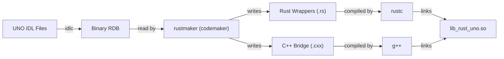

# Rust UNO Developer Guide

<!--toc:start-->
- [Rust UNO Developer Guide](#rust-uno-developer-guide)
  - [Table of Contents](#table-of-contents)
  - [Project Overview](#project-overview)
  - [Codebase Structure](#codebase-structure)
    - [Code Generator (`codemaker`)](#code-generator-codemaker)
    - [Runtime Library (`rust_uno`)](#runtime-library-rustuno)
  - [The Rustmaker Generator](#the-rustmaker-generator)
    - [Generation Flow](#generation-flow)
    - [Key Implementation Details](#key-implementation-details)
  - [Development Workflow](#development-workflow)
    - [Prerequisites](#prerequisites)
    - [Rebuilding Bindings](#rebuilding-bindings)
  - [Testing Strategy](#testing-strategy)
    - [Integration Tests](#integration-tests)
    - [Unit Tests](#unit-tests)
    - [Future Work: Embindtest](#future-work-embindtest)
<!--toc:end-->

This guide is intended for contributors working on the **Rust UNO bindings** implementation itself. If you are a user looking to *use* the bindings, please see the [User Guide](Rust_UNO_User_Guide.md).

## Table of Contents

1. [Project Overview](#project-overview)
2. [Codebase Structure](#codebase-structure)
3. [The Rustmaker Generator](#the-rustmaker-generator)
4. [Development Workflow](#development-workflow)
5. [Testing Strategy](#testing-strategy)

---

## Project Overview

The Rust UNO project enables LibreOffice to be scripted and extended using Rust. It works by inspecting the UNO IDL (Interface Definition Language) types and generating:

1. **Rust Wrappers**: Safe, idiomatic Rust structs.
2. **C++ Bridges**: `extern "C"` functions that handle the raw UNO C++ API.

The system is fully integrated into the LibreOffice build system via `autogen.sh` and `make`.

---

## Codebase Structure

The project is split across the core LibreOffice codebase:

### Code Generator (`codemaker`)

Located in `codemaker/source/rustmaker/`. This tool reads the binary type library (RDB files) and outputs source code.

| File | Purpose |
|------|---------|
| `rustproduce.cxx` | Generates Rust source files (structs, enums, interfaces). |
| `cpproduce.cxx` | Generates the C++ side of the bridge. |
| `unoproduce.cxx` | Coordinator that drives the generation process. |
| `rustfile.cxx` | Helper for writing Rust source files (indentation, imports). |

### Runtime Library (`rust_uno`)

Located in `rust_uno/`. This is the crate that users depend on.

- `src/lib.rs`: Crate root, exports `generated` modules.
- `src/generated/`: Destination for generated Rust code.
- `src/core/`: Handwritten core utilities (`OUString` wrapper, primitive types).

---

## The Rustmaker Generator

The heart of the project is the `rustmaker` binary. It runs during the build process to produce the bindings.

### Generation Flow



### Key Implementation Details

- **Typed Parameters**: Methods are generated with native types (e.g. `i32`, `bool`) where possible.
- **Opaque Pointers**: All UNO objects are held as `*mut c_void` in Rust, pointing to a `Ref<Interface>` in C++.
- **Memory Management**: The `Drop` trait implementation calls the C++ destructor, which releases the UNO reference.

---

## Development Workflow

### Prerequisites

Ensure you have a full LibreOffice build environment and have run `./autogen.sh --enable-rust-uno`.

### Rebuilding Bindings

When you modify `codemaker`, you need to regenerate the bindings:

```bash
# Rebuild the generator
make codemaker

# Regenerate the source files
make rust_uno

# Rebuild the final library
make
```

> [!TIP]
> If you see bizarre errors after changing `rustmaker`, try `make rust_uno.clean` first to force a fresh generation.

---

## Testing Strategy

Testing is integrated into the LibreOffice startup sequence for basic sanity checks.

### Integration Tests

The entry point `run_rust_uno_test` in `rust_uno/src/lib.rs` is called by `soffice` on startup.
It runs scenarios defined in `rust_uno/src/examples/`.

To run the tests:

```bash
./instdir/program/soffice --norestore
```

Watch the console output for `=== Rust UNO Bridge Test ===`.

### Unit Tests

Pure Rust unit tests (for `OUString` logic, etc.) can be run via Cargo:

```bash
cd rust_uno
cargo test
```

### Future Work: Embindtest

We plan to integrate with `embindtest`, the comprehensive UNO test suite. This is a high-priority task to ensure full coverage of generated types.

## Roadmap and Missing Features

This section details the current implementation status and future development tasks, ordered by architectural dependency and impact.

### Implementation Status

The following table summarizes the generation status of UNO types in `codemaker`.

| UNO Type | Status | Generator Function | Notes |
|----------|--------|-------------------|-------|
| **Module** | Implemented | `produceModule()` | Generates directory structure and `mod.rs` files. |
| **Enum** | Implemented | `produceEnum()` | Full support including validation and bridge functions. |
| **Struct** | Implemented | `produceStruct()` | Generates PlainStructs with getters, setters, and constructors. |
| **Interface** | Implemented | `produceInterface()` | Generates traits, wrappers, and reference-counting logic. |
| **Service** | Partial | `produceService()` | Supports single-interface services; accumulation-based services are deprecated. |
| **Sequence** | Partial | `rustproduce.cxx` | Currently handled as `void*` in FFI; lacks safe Rust wrappers. |
| **ConstantGroup** | Not Implemented | `produceConstantGroup()` | Function exists but body contains only a log message; content is skipped. |
| **Exception** | Not Implemented | `produceException()` | Function exists but body contains only a log message; code generation is missing. |

### Development Tasks

The following tasks are ordered by their foundational importance to the binding quality.

#### 1. ConstantGroup Generation
**Goal**: Generate Rust constants for UNO ConstantGroups (e.g., `com.sun.star.awt.FontWeight`).
**Files**: `codemaker/source/rustmaker/rustproduce.cxx`, `cpproduce.cxx`
**Details**: Currently, `produceConstantGroup` prints a skipping message. This needs to look up the constants in the IDL entity and generate a Rust `module` with `const` items.

#### 2. Exception Mapping
**Goal**: Integrate UNO exceptions with Rust's `Result` type.
**Files**: `codemaker/source/rustmaker/`
**Details**:
*   Generate structs for UNO Exception types (`produceException`).
*   Update method signatures to return `Result<T, UnoError>` instead of `Option<T>`.
*   The C++ bridge currently catches exceptions but does not fully propagate type information to Rust.

#### 3. Typedef Resolution
**Goal**: Resolve UNO typedefs to their concrete Rust types.
**Files**: `codemaker/source/rustmaker/unoproduce.cxx`
**Details**: `produceTypedef` currently prints a log message. It should resolve the aliased type and generate a `type Alias = ConcreteType;` definition in Rust.

#### 4. Singleton Generation
**Goal**: Generate accessors for UNO singletons.
**Files**: `codemaker/source/rustmaker/rustproduce.cxx`
**Details**: `produceSingleton` is currently a placeholder. It should generate helper methods to retrieve the singleton instance (typically via component context), avoiding manual `createInstance` calls.

#### 5. Type-Safe Sequences
**Goal**: Replace `void*` usage for Sequences with a proper `Sequence<T>` wrapper.
**Files**: `codemaker/source/rustmaker/rustproduce.cxx`, `rust_uno/src/core/`
**Details**: Implement a `Sequence` struct that manages the memory layout compatible with UNO sequences and implements `Iterator`.

---

