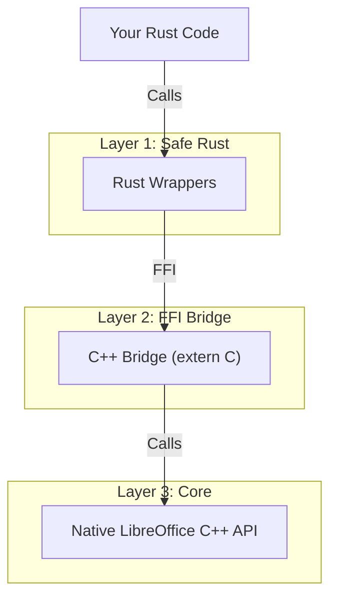

# Rust UNO User Guide

<!--toc:start-->
- [Rust UNO User Guide](#rust-uno-user-guide)
  - [Table of Contents](#table-of-contents)
  - [Introduction](#introduction)
  - [Prerequisites & Setup](#prerequisites-setup)
    - [Requirements](#requirements)
    - [Enabling Rust Support](#enabling-rust-support)
    - [Building](#building)
  - [Architecture Overview](#architecture-overview)
  - [Quick Start](#quick-start)
    - [1. Dependencies](#1-dependencies)
    - [2. Loading a Document](#2-loading-a-document)
  - [Core Concepts](#core-concepts)
    - [Interfaces](#interfaces)
    - [Strings](#strings)
    - [Memory Management](#memory-management)
    - [Troubleshooting](#troubleshooting)
<!--toc:end-->

Welcome to the **Rust UNO Bindings** user guide. This document provides comprehensive instructions for using Rust to interact with LibreOffice via the UNO (Universal Network Objects) API.

## Table of Contents

1. [Introduction](#introduction)
2. [Prerequisites & Setup](#prerequisites--setup)
3. [Architecture Overview](#architecture-overview)
4. [Quick Start](#quick-start)
5. [Core Concepts](#core-concepts)
6. [Troubleshooting](#troubleshooting)

---

## Introduction

The Rust UNO bindings provide a safe, high-performance interface to automate LibreOffice. Unlike Python or Java bindings which rely heavily on runtime reflection, Rust UNO uses **compile-time generated wrappers** ensuring:

- **Type Safety**: Errors are caught at compile time.
- **Performance**: Zero-cost abstractions over the C++ bridge.
- **Memory Safety**: Automatic resource management via RAII (Drop trait).
- **Typed Parameters**: Methods take native Rust types (`bool`, `i32`) instead of unsafe `void*` pointers.

---

## Prerequisites & Setup

To use Rust UNO, you must build it as part of LibreOffice.

### Requirements

- **Rust**: Stable toolchain (install via `rustup`).
- **LibreOffice Build Deps**: Standard development environment for LibreOffice.
- **Disk Space**: Sufficient space for a full LibreOffice build.

### Enabling Rust Support

Add the following to your `autogen.input` file or pass it to `autogen.sh`:

```bash
--enable-rust-uno
```

### Building

Run the following commands to generate bindings and build LibreOffice:

```bash
./autogen.sh
make codemaker # Builds the IDL compiler
make rust_uno  # Generates Rust/C++ bridge code
make           # Final build
```

> [!NOTE]
> The generated Rust unit tests run automatically during the build process to verify the bridge.

---

## Architecture Overview

The bindings utilize a 3-layer architecture to safely bridge safe Rust with C++ UNO.



1. **Rust Wrappers** (`rust_uno/src/generated/`): Safe structs holding opaque pointers. Methods are fully typed.
2. **C++ Bridge** (`workdir/CustomTarget/rust_uno/rustmaker/cpp/`): Handles exception catching and reference counting.
3. **Native UNO**: The actual LibreOffice implementation.

---

## Quick Start

### 1. Dependencies

Ensure your `Cargo.toml` includes the dependencies. Since `rust_uno` is currently built in-tree, you point to it using a path dependency:

```toml
[dependencies]
rust_uno = { path = "rust_uno" }
```

### 2. Loading a Document

Here is a complete example of bootstrapping UNO and loading a Writer document. This demonstrates the **Typed Parameter API**.

```rust
use rust_uno::generated::rustmaker::com::sun::star::frame::{Desktop, XComponentLoader};
use rust_uno::generated::rustmaker::com::sun::star::text::XTextDocument;
use rust_uno::core::{OUString, uno_wrapper::defaultBootstrap_InitialComponentContext};
use std::ptr;

fn main() -> Result<(), Box<dyn std::error::Error>> {
    // 1. Bootstrap the component context
    let context = defaultBootstrap_InitialComponentContext()?;

    // 2. Create the Desktop service
    // Wrappers take raw pointers for low-level compatibility, or other wrappers
    let desktop = Desktop::create(context.as_ptr())
        .ok_or("Failed to create Desktop service")?;

    // 3. Query the XComponentLoader interface
    // Interface conversion is explicit and safe
    let loader = XComponentLoader::from_ptr(desktop.as_ptr())
        .ok_or("Desktop does not support XComponentLoader")?;

    // 4. Load a blank Writer document
    let url = OUString::from("private:factory/swriter");
    let target = OUString::from("_blank");

    // Note: Typed parameters! No casting to void* needed.
    let component = loader.loadComponentFromURL(
        url,                // Passed by value (moved) or reference depending on signature
        target,
        0,                  // i32
        ptr::null_mut()     // Any/Sequence arguments
    ).ok_or("Failed to load component")?;

    // 5. Use the document
    if !component.as_ptr().is_null() {
         let text_doc = XTextDocument::from_ptr(component.as_ptr())
             .ok_or("Loaded component is not a TextDocument")?;

         if let Some(text) = text_doc.getText() {
             println!("Document loaded successfully!");
             // text.setString(OUString::from("Hello Rust!"));
         }
    }

    Ok(())
}
```

---

## Core Concepts

### Interfaces

UNO interfaces map directly to Rust structs.

- **C++**: `Reference<XInterface>`
- **Rust**: `pub struct XInterface { ptr: *mut c_void }`

### Strings

LibreOffice uses `OUString` (UTF-16). The bindings provide efficient conversion:

- `OUString::from("Hello")`: Rust string slice -> OUString
- `ou_string.to_string()`: OUString -> Rust String

### Memory Management

Rust's `Drop` trait automatically calls `acquire` and `release` on the underlying UNO objects via the C++ bridge. You do not need to manually manage reference counts.

### Troubleshooting

| Issue | Cause | Solution |
|-------|-------|----------|
| `make rust_uno` fails | Codemaker out of date | Run `make rust_uno.clean && make codemaker && make rust_uno` |
| Runtime panic "Symbol not found" | LD_LIBRARY_PATH missing | Run your binary via `instdir/program/soffice --norestore` environment or set paths manually. |
| `Option::None` from query | Interface not supported | Check API docs to ensure the object supports the interface you are querying. |

> [!TIP]
> Always check `instdir/program/soffice` execution logs. The rust bridge prints initialization status to stdout/stderr with `SAL_WARN` channels if enabled.
